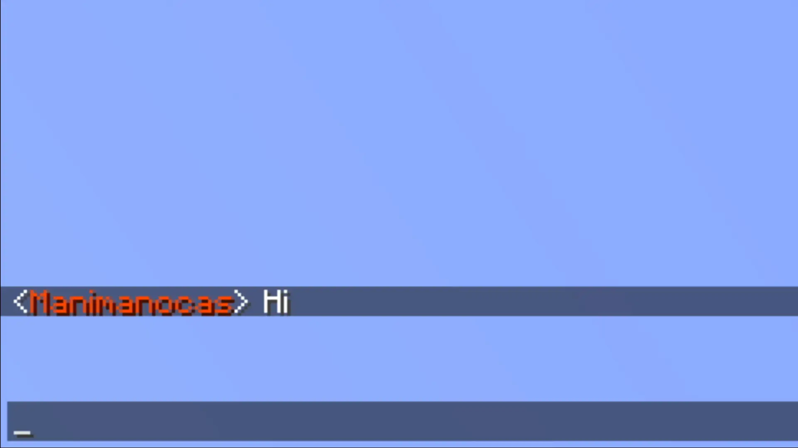
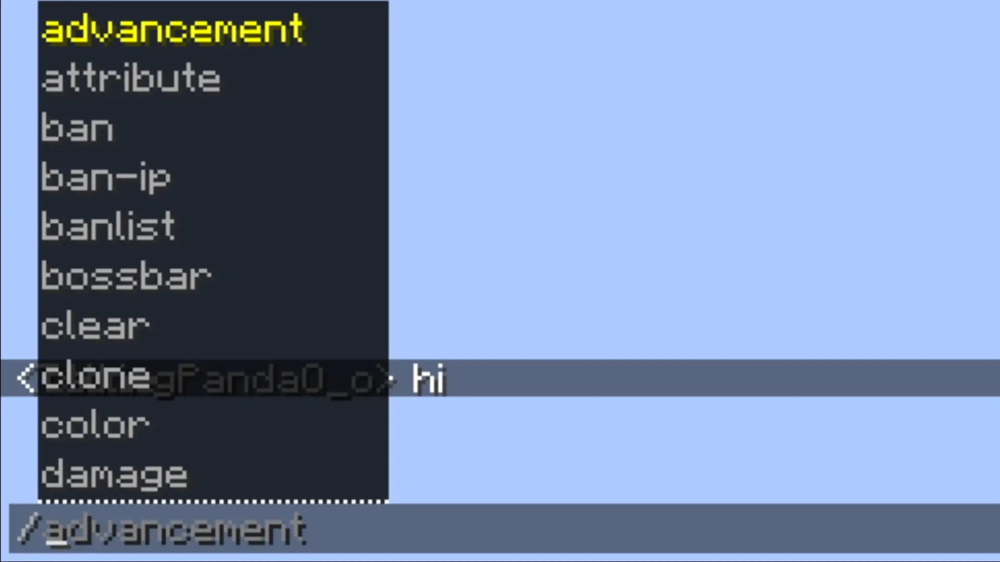

# Emotes
Emotes can be added by operators and managers, they can be animated and can be used in chat, signed books, anvil, signs.

# Replies
You can reply to messages by clicking on them

# Name Colors
You can change your name color to any of the twitch name colors or any hex color 

# Player Heads
You can put a players head in chat if you put their name between `< >`, they don't need to be on the server or even online.

# Url
Any url typed in chat will become clickable

